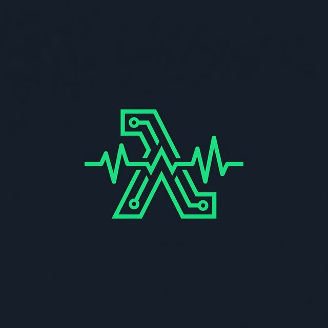

# ⚡ Serverless Orchestrator

<p align="center">
  
</p>

<h3 align="center">Serverless Orchestrator</h3>

<p align="center">
  A premium, open-source platform for single-click instrumentation of your AWS Lambda functions. Automate telemetry, configure observability layers, and manage New Relic & Datadog integrations across accounts and regions — all from a single dashboard.
</p>

<p align="center">
  <a href="https://opensource.org/licenses/Apache-2.0">
    
  </a>
  <a href="https://golang.org/">
    
  </a>
  <a href="https://vuejs.org/">
    
  </a>
  <a href="https://aws.amazon.com/">
    
  </a>
  <a href="https://vectorsight.tech">
    
  </a>
</p>

---

## 🎯 What is Serverless Orchestrator?

Managing serverless observability at scale can be challenging. **Serverless Orchestrator** is a lightweight, open-source tool that provides **single-click instrumentation** for your AWS Lambda functions. It handles the complex AWS configuration, New Relic & Datadog account linking, and Lambda layer management for you. 

Instead of configuring settings file-by-file or writing custom CLI commands, you get an interactive dashboard UI to manage all operations concurrently.

---

## ✨ Features at a Glance

| Feature | Description | Interactive Status |
| :--- | :--- | :---: |
| **Multi-Connection Dashboard** | Register and switch between different AWS regions and account credentials instantly. | 🟢 Ready |
| **Bulk Instrumentation** | Attach/detach telemetry layers to dozens of Lambda functions concurrently. Supports Node.js, Python, Java, .NET, and Ruby. | 🟢 Ready |
| **Automated Account Linking** | Resolves IAM role ARNs and registers AWS connections via New Relic NerdGraph or Datadog APIs. | 🟢 Ready |
| **Metric Streams Integration** | Provision CloudWatch Metric Streams, Kinesis Firehose, and IAM roles via CloudFormation. | 🟢 Ready |
| **Self-Cleaning Deploys** | Auto-detects and removes failed/stuck CloudFormation stacks before retrying. | 🟢 Ready |
| **Internal Safety Filtering** | Excludes management stacks and orchestrator helpers from instrumentation risks. | 🟢 Ready |

---

## 🏗️ Architecture Design

```
                     ┌───────────────────────────────┐
                     │          Vue 3 UI             │
                     │  (Vite + TypeScript SPA)      │
                     └──────────────┬────────────────┘
                                    │
                                    │ HTTP / JSON
                                    ▼
                     ┌───────────────────────────────┐
                     │      Go Gateway Backend       │
                     │   (Encrypted SQLite Store)    │
                     └──────────────┬────────────────┘
                                    │
                                    │ Secure Lambda Invoke
                                    ▼
                     ┌───────────────────────────────┐
                     │    Go Lambda Orchestrator     │
                     │     (AWS Engine Instance)     │
                     └──────────┬──────────────┬─────┘
                                │              │
              AWS CloudFormation│              │New Relic / Datadog API
              (Metric Streams)  ▼              ▼ (Account Link APIs)
                        [AWS Account]   [Observability Platforms]
```

---

## ⚙️ Requirements & Dependencies

* **Go 1.22+** (Backend gateway & orchestrator binary compilation)
* **Node.js 18+ & NPM** (Vue 3 client dev and production build)
* **Python 3.10+** (Compiling & packaging execution scripts)
* **AWS CLI & AWS SAM CLI** (Cloud deployment and stack creation)

---

## 🚀 Setup & Launch Guide

Click on the sections below to view the detailed step-by-step setup guides:

<details>
<summary><b>1. Deploying the Orchestrator Lambda Engine</b></summary>
<br>

First, deploy the serverless execution engine into the target AWS account and region you want to manage:

```bash
cd lambda

# 1. Package the Go Lambda binary and template
python pack.py

# 2. Deploy using SAM CLI (guided walkthrough)
sam deploy --guided
```

Once the stack finishes deploying, make sure to copy these outputs from the console:
* `OrchestratorApiUrl` (The endpoint URL for the API Gateway)
* `OrchestratorApiKey` (The secure API Key generated for your gateway)

* **Environment Variables (Optional):** You can set provider credentials directly as environment variables on your Orchestrator Lambda function to keep your requests clean:
  * **Datadog:** `DATADOG_API_KEY`, `DATADOG_SITE`
  * **New Relic:** `NEW_RELIC_LICENSE_KEY`, `NEW_RELIC_ACCOUNT_ID`, `NEW_RELIC_API_KEY`, `NEW_RELIC_REGION`

</details>

<details>
<summary><b>2. Configuring the Backend Gateway</b></summary>
<br>

The backend gateway handles connection settings, performs encryption, and logs user actions:

```bash
cd backend

# 1. Tidy modules and cache dependencies
go mod tidy

# 2. Start the HTTP server (defaults to port 9000)
go run ./cmd/server/main.go
```

* **Database:** An SQLite database file named `serverless_orchestrator.db` will be automatically initialized in the backend directory.
* **Environment Variables:** You can set the following parameters to override default settings:
  * `DATABASE_URL` (custom path/connection string)
  * `JWT_SECRET` (custom authentication signing key)
  * `ENCRYPTION_KEY` (64-character hex string to encrypt credentials)
  * `DATADOG_API_KEY` (Datadog API Key for provider credential mapping)
  * `DATADOG_SITE` (Datadog region host, e.g. `us5.datadoghq.com` or `datadoghq.eu`)

</details>

<details>
<summary><b>3. Running the Dashboard Application</b></summary>
<br>

Start the web client to interact with the system:

```bash
cd frontend

# 1. Install Node modules
npm install

# 2. Launch the developer web server
npm run dev
```

* Open your browser to the local URL (typically `http://localhost:5173`).
* **First-time Onboarding:** If this is your first launch, toggle **Sign Up** on the login screen to register your local administrator account credentials.
* **Configure Connections:** Navigate to **Settings** -> **Connections**, click **Add Connection**, and fill in the details from the Orchestrator Lambda outputs.
* **Dashboard Control:** Switch to the new connection from the header dropdown to start managing your functions.


</details>

---

## 🤝 Contributing

We welcome contributions! Please read our [Contributing Guide](CONTRIBUTING.md) to get started.

- 📋 [Code of Conduct](CODE_OF_CONDUCT.md)
- 🔐 [Security Policy](SECURITY.md)
- 📝 [Changelog](CHANGELOG.md)

---

## 📜 License

Copyright © 2026 [VectorSight Technologies](https://vectorsight.tech). All rights reserved.

This project is licensed under the **Apache License 2.0** — see the [LICENSE](LICENSE) file for details.

> Licensed under the Apache License, Version 2.0 (the "License"); you may not use this file except in compliance with the License. You may obtain a copy of the License at [http://www.apache.org/licenses/LICENSE-2.0](http://www.apache.org/licenses/LICENSE-2.0).

